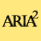

<h1>mods</h1>
<h2>a slightly modified version of softwares. usually just the manifest.</h2>

When modification is not possible, 
(i.e. the binary file will get f*cked) 
only a manifest file(s) will be preset, 
this means <a href="https://gist.github.com/eladkarako/d24d5ed3c917ef230b0fc990104f9fe6">you need to apply a system-wide fix</a>, 
to favor a side-by-side <code>.manifest</code> file, 
over a manifest resource. 
 

I've used <a href="https://github.com/eladkarako/manifest/">github.com/eladkarako/manifest</a> 
to do the modification, so if you would like to override the manifest fix, 
or improve it, download <a href="https://github.com/eladkarako/manifest/">github.com/eladkarako/manifest</a> and provide an alternative-content to the <code>generic.manifest</code>, (btw. an alternative for ignoring DPI-scale is already there...).

<a href="7z/"                >&nbsp;7z/</a> 
<a href="Aria2/"             >&nbsp;Aria2/</a> 
<a href="AWiconsPro/"        >&nbsp;AWiconsPro/</a> 
<a href="Babylon/"           >&nbsp;Babylon/</a> 
<a href="Matrix_ks/"         >&nbsp;Matrix_ks/</a> 
<a href="NetLimiter/"        >&nbsp;NetLimiter/</a> 
<a href="Babylon/"           >&nbsp;Babylon/</a> 
<a href="chromium/"          >&nbsp;chromium/</a> 
<a href="Clear/"             >&nbsp;Clear/</a> 
<a href="ffmpeg/"            >&nbsp;ffmpeg/</a> 
<a href="Fiddler/"           >&nbsp;Fiddler/</a> 
<a href="FSCapture/"         >&nbsp;FSCapture/</a> 
<a href="KatMouse/"          >&nbsp;KatMouse/</a> 
<a href="Locate32/"          >&nbsp;Locate32/</a> 
<a href="Orbitdownloader/"   >&nbsp;Orbitdownloader/</a> 
<a href="PaintNet4/"         >&nbsp;PaintNet4/</a> 
<a href="Notepad%202.0/"     >&nbsp;Notepad2.0/</a> 
<a href="Notepad++/"         >&nbsp;Notepad++/</a> 
<a href="ThinkPadUtilities/" >&nbsp;IBM/Lenovo ThinkPad - Utilities/</a> 
<a href="TrayMinimizer/"     >&nbsp;TrayMinimizer/</a> 
<a href="Unlocker/"          >&nbsp;Unlocker/</a> 
<a href="WinDirState/"       >&nbsp;WinDirState/</a> 
<a href="WinSCP/"            >&nbsp;WinSCP/</a> 

