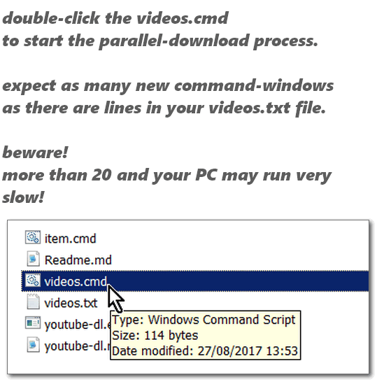

 

<em>P</em> Is For Parallel! 

 

 

<h1>YouTube-DL<em>-P</em> - &nbsp; &nbsp; </h1>

<h2>Download URLs From A Text-File, In Parallel <em>(Not One-By-One!)</em></h2>

 

<ul>
<li>Multipart download by default using <a href="https://github.com/q3aql/aria2-static-builds/releases/">aria2c</a>, as an external-downloader.</li>
<li>Parallel (No Waiting!) Multi-Process Download Of URLs.</li>
<li><em>+ bonus stuff under <code>resources</code> folder... :]</em></li>
</ul>

In this repository you'll find two files:
<code>ytdl2download.cmd</code>, which is a simple wrap for using YouTube-DL with aria2c as a default external downloader, 
<code>ytdl2download.cmd</code> will accept any command-line you normally have with <code>youtube-dl.exe</code>, <em>(just check to see if they are already existing in the batch before adding them...)</em> 
and <code>ytdl2parallel.cmd</code> which accepts a single argument: the path to a line-separated text-file containing a list of URLs. It will use <code>start</code> to run many YouTube-DL processes in parallel.
 
Using <code>ytdl2parallel.cmd</code> saves you a lot of time and makes a better use of your bandwidth. 
Using <code>ytdl2download.cmd</code> as an external-downloader helps you do the same thing, 
along with increased efficiency in downloading and data-writing to disk.

Using <code>aria2c</code> will also <em>"magically"</em> resolve an issue (really just a workaround...) of download errors because of too many opened connections <em>(see screenshots below)</em>.

<h3>Increasing amount of <em>Half-Opened Connections</em></h3>

You are probably using a Windows version of Vista/7/8/...+ 
check the resources folder for <code>windows7_increase_open_connections.reg</code>, <code>windows7_increase_open_connections_extreme.reg</code> (and <code>windows7_increase_open_connections {UNDO}.reg</code>). 
No N00bs! Admins only! 
 
It will allow you to download many active-connections in parallel,
which means faster download and no-more timeouts. <strong>Will enhance browsing <em>and torrenting</em> too!</strong>.

In the <code>resources</code> folder you'll also find <code>download list of video links.js</code>,
it is a simple javascript file that you should run in a YouTube page, using the developer's-console.
<code>download list of video links.js</code> will make a <code>list.txt</code> <strong>FOR YOU</strong>, it only collects the visible links in the page and might include stuff you don't need such as other video-recommendations from the side panel, or similar locations on the page, it really is just for you as a template, you may enhance it or limit it to a specific container in the <a href="https://en.wikipedia.org/wiki/Document_Object_Model">DOM tree</a> (it will probably require some web-developer knowledge).

<h3>Adding to System's <code>PATH</code></h3>
both <code>youtube-dl.exe</code> and <code>aria2c.exe</code> are included, 
all you have to do is to download this repository and place it anywhere on your PC, 
you can add it to your system's <code>PATH</code> and it will allow you to run <code>ytdl2download.cmd</code> and <code>ytdl2parallel.cmd</code> from any folder, to easily download to a specific folder.

Note that this repository includes side-by-side manifest-files, 
to help you work better under Windows-10, but you'll be required to apply 
a <a href="https://gist.github.com/eladkarako/d24d5ed3c917ef230b0fc990104f9fe6#file-manifest-prefer-external-side-by-side-file-over-internal-resource-reg">one time registry fix</a> (optional) to make it work. If everything works out fine for you 
you can skip applying any fix.

 

 
 
 
 
 
 
 
 
 
 
 

 

 

Edit: 
<code>ytdl2parallel.cmd</code> uses <code>ytdl2download.cmd</code>, 
both <code>ytdl2download.cmd</code> and <code>ytdl2list.cmd</code> uses <code>ffmpeg</code> by default, 
since <code>Aria2C</code> is quite problematic. You may comment-out the lines under <code>::------use ffmpeg
</code> - and remove the comment from <code>::------use aria2c</code> lines to re-enable it. Things will still download in parallel, as is each of the files in the list will be downloaded in parallel to the others, but ffmpeg does not support multi-part downloading (as Aria2C does).

Edit: 
If you only want a "shortcut" for downloading using <code>youtube-dl.exe</code>, 
you can use <code>ytdl2download.cmd</code> for an explicit URL downloading or <code>ytdl2list.cmd</code> for an explicit downloading from a text-list file, 
but you may use <code>ytdl.cmd</code> that will find-out itself how to download, 
you may use either a URL or a list-file from your PC, as the first argument, 
and include any amount of additional 'YouTube-dl' switches after, to be included 'as is'.
 
In most cases <code>ytdl.cmd</code> is what you want, it is a wrapper for the default arguments for downloading from standard/secure-websites without any certificate issues, there are also some debug-notes that will help you figure-out the video-quality and any ffmpeg commands that runs in the background, it is also very helpful mode to debug youtube-dl if you wish to include any <a href="https://github.com/rg3/youtube-dl/issues">new-bug report for the youtube-dl developers</a>.

You probably want to include <code>--no-call-home</code>, and <strong>ALSO block it in your HOSTS file too</strong>:

<pre>
0.0.0.0 rg3.github.io
0.0.0.0 yt-dl.org
0.0.0.0 youtube-dl.org
0.0.0.0 ytdl.aries.uberspace.de

0.0.0.0 www.rg3.github.io
0.0.0.0 www.yt-dl.org
0.0.0.0 www.youtube-dl.org
0.0.0.0 www.ytdl.aries.uberspace.de

0.0.0.0 mx.yt-dl.org
0.0.0.0 mx.youtube-dl.org
0.0.0.0 mx.ytdl.aries.uberspace.de
</pre>

latest links (chain of 302 redirects...)
<pre>
(youtube-dl / youtube-dl.exe)

http://youtube-dl.org/downloads/latest/youtube-dl
(HTTP 302) http://youtube-dl.org/downloads/2018.04.16/youtube-dl                      (for example. will change each version..)
(HTTP 302) https://github.com/rg3/youtube-dl/releases/download/2018.04.16/youtube-dl  (for example. will change each version..)
(HTTP 302) https://github-production-release-asset-2e65be.s3.amazonaws.com/........&response-content-disposition=attachment%3B%20filename%3Dyoutube-dl&response-content-type=application%2Foctet-stream   (for example. will change each version..)
</pre>

to keep HOSTS-blocking stay-active, while still downloading,
use cURL's resolve feature (to 95.143.172.170) -- like-so: <em>(remove new-lines, merge to one long line..)</em>

<pre>
curl --ipv4 --anyauth --insecure --location-trusted --verbose 
--url "http://youtube-dl.org/downloads/latest/youtube-dl.exe" --output "youtube-dl.exe"
--resolve "youtube-dl.org:443:95.143.172.170" 
--resolve "youtube-dl.org:80:95.143.172.170"
</pre>

See `updater\updater.cmd` for a batch that will download the most updated version of the windows/plain-python version (and also update the help-readme for new stuff).

 
 
 
 
 

`YouTube-DL.exe` vs. `YouTube-DL.cmd`
`YouTube-DL.exe` is a self-uncompressed/packed Python-libs and main script of `YouTube-DL`, it is known to be problematic and have multi-process issues and various inaccurate Exit-Code states.

`YouTube-DL.cmd` uses the pure Python scripts from the `youtube-dl`-folder, and loads them with `WinPython`-folder (it is a portable, minified version of python named `WinPython Zero`).
Since nothing gets unpacked and there is a very little I/O operations it works faster, plus multi-proceess python-scripts works fine.

more notes about this in [youtube-dl/README.md](youtube-dl/README.md).