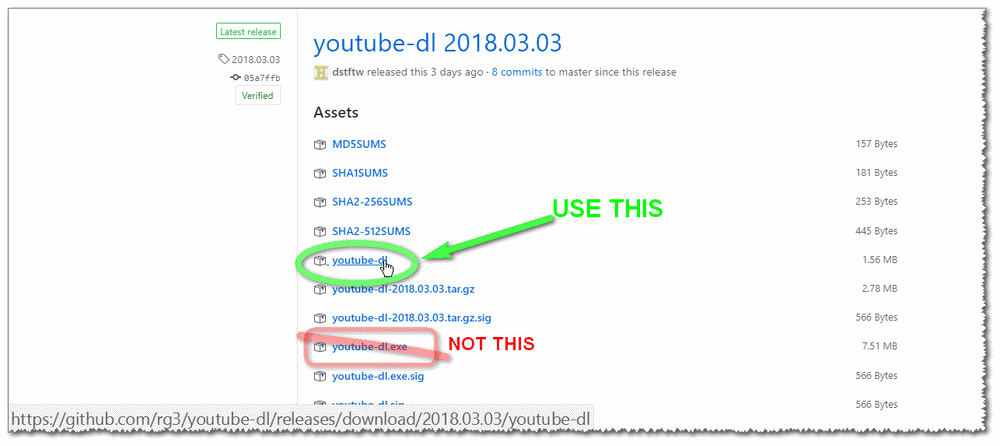

This folder contains both (1)`exe`+`youtube-dl.exe.manifest` and (2)`youtube_dl`+`__main__.py`.

If the `../youtube-dl.cmd` will find Python in your PC,
it will use `youtube_dl`+`__main__.py` as a way of running YouTube-DL.

It works better.

 

If Python isn't found on the PC the operation will fallback to using `youtube-dl.exe`.

[WinPython](http://winpython.github.io/) (there is a 'zero' version which is free, portable and just ~70MB).

Argument from Windows CMD to Python acts funny!

- If you DO need to specify, for example, paths (such as in `--ffmpeg-location`, it works better if you'll replace `\` with `/`   - you can also use `\\`),
- You should escape some stuff, for example passing `"` character to YouTube-DL should be passed like so: `\"` - for example: `--postprocessor-args "-hide_banner -flags \"+low_delay+global_header\" -flags2 \"+export_mvs\" -fflags \"+autobsf+genpts+discardcorrupt-fastseek-nofillin-ignidx-igndts\" -movflags \"+faststart+disable_chpl\"".  this part `--postprocessor-args "...content..."` will be stripped by Windows-command-line and passed to python, marking first argument as `--postprocessor-args` and second argument as the entire `...content...`, and python will handle it from there (`\"` to `"`, etc..).

Updating:

even though both `https://yt-dl.org/downloads/latest/youtube-dl` and `https://ytdl.aries.uberspace.de/downloads/latest/youtube-dl` will redirect to latest download from GitHub.
but you better just download it manually every now and again.

you need to extract the content using 7zip and replacing (better to pre-remove) the old content with the new one.
you may also update the `youtube-dl.exe` too, but the command `where python.exe` result with something meaningful on your PC - you don't have to.

302 redirect sample:
<pre>
https://ytdl.aries.uberspace.de/downloads/latest/youtube-dl                 -&gt;
https://ytdl.aries.uberspace.de/downloads/2018.03.03/youtube-dl             -&gt;
https://github.com/rg3/youtube-dl/releases/download/2018.03.03/youtube-dl   -&gt;
https://github-production-release-asset-........s3.amazonaws.com/...
</pre>